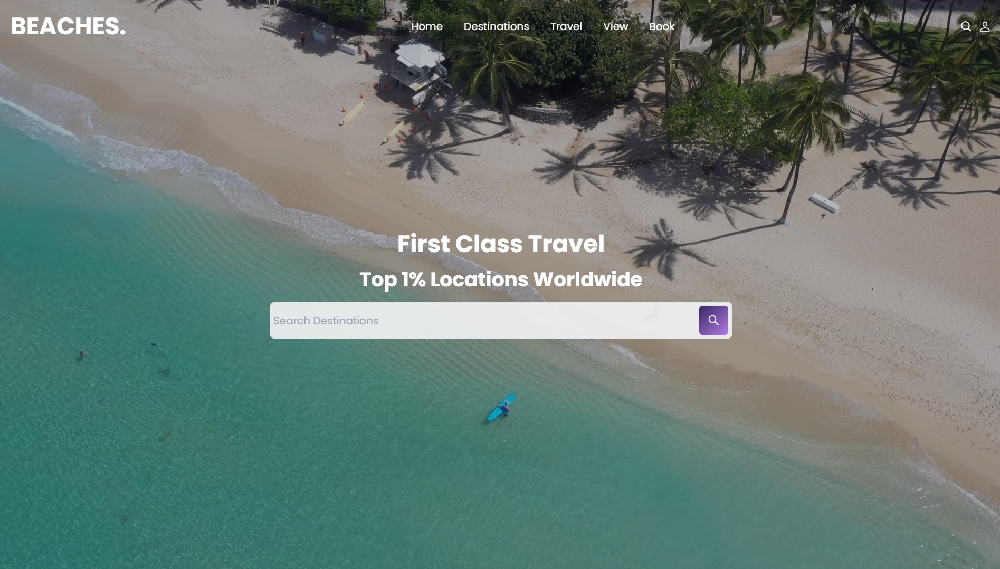

# React-TW-Traveasy

## Description

React-TW-Traveasy is a travel booking website built with React.js and Tailwind CSS. It allows users to explore various travel destinations, view detailed information about each destination, and book their travel arrangements.

## Features

- Browse a curated list of destinations.
- View detailed information about each destination, including photos, descriptions, and pricing.
- Book travel arrangements such as flights, accommodations, and activities.
- Responsive design for seamless browsing on desktop and mobile devices.

## Technologies Used

- React.js: A JavaScript library for building user interfaces.
- Tailwind CSS: A utility-first CSS framework for building responsive and custom designs.
- React Router: A routing library for React applications.

## Usage

- Explore the list of destinations on the homepage.
- Click on a destination to view more details and book travel arrangements.

## Responsive Design

React-TW-Traveasy is designed to be responsive, ensuring a seamless user experience across various devices and screen sizes.

## Contributing

Contributions are welcome! If you'd like to contribute to this project, please follow these steps:

1. Fork the repository.
2. Create a new branch for your feature or bug fix.
3. Make your changes and commit them with descriptive commit messages.
4. Push your changes to your fork.
5. Submit a pull request.

## License

This project is licensed under the [MIT License](LICENSE).

## Acknowledgements

- This project was inspired by [https://github.com/fireclint].
